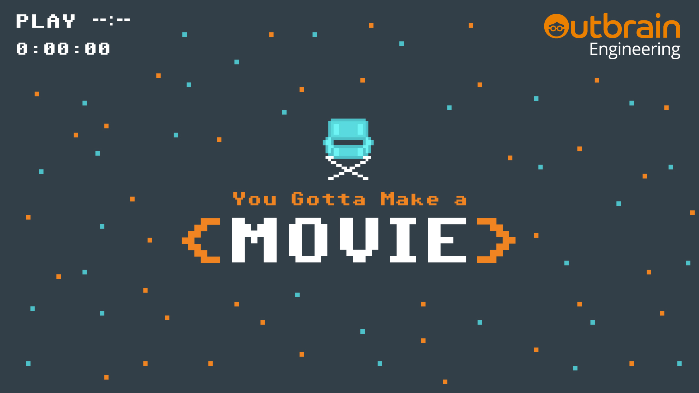

  

# You Gotta Make a Movie Night Challenge

Outbrain's frontend guild is proud to host the YGLF night event - "**You Gotta Make a Movie**"!
In this challenge you're going to work in couples and remake a famous movie scene as a cool-funny-creative-mind-blowing video, using only frontend technologies.

# Prizes

- 1st place - **2 Sony Playstations (Classic Edition)**
- 2nd place - **2 Polaroid Cameras**
- 3rd place - **2 Tetris Devices**

# Guidelines

Please follow the guidlines below:

- You'll work in couples. 
- We provide 5 default base scenes (could be found in the `scenes` folder), and you may either use them or bring one of your own.
- The final video result should be no longer than **20 seconds**.
- Feel free to use **any** frontend technology you want.
- The entry point to your work should be an `index.html` file.
- Your code should run on the latest version of Chrome.
- **Do not** violate copyrights by sharing your work in public (or outside of YGLF).

# How to Win?

- We're looking for creativity and innovation, as well as concepts that will blow our mind off.
- Add sounds, subtitles, change the original video and manipulate it, that's exactly what we want to see.
- You'll get extra bonus for using advanced web technology such as Tensorflow, image manipulation, sound editing, etc.
- Frontend jokes are more than welcome, as long as they are not offensive. and funny.
- Be ready for a 60 seconds presentation at the end of the event.

# How to Submit Your Work?

1. Fork [this](https://github.com/outbrain/you-gotta-make-a-movie-challenge) repo.
2. Navigate to the "**submissions**" folder, and create a new folder with your team's name. Folder name should be lowercased and without spaces or special characters (use dashed instead. For example: "tsachi-daniel", or "team-awesome").
3. Add all relevant files to your folder, **including a `README.md` file** with an overview and instructions about your project.
4. Add your submission to the **[list of submissions](https://github.com/outbrain/you-gotta-make-a-movie-challenge/tree/master/submissions)** in the `README.md` file under the `submissions` folder.
4. Once your code is ready, commited, and pushed, create a pull request, and ping us to make sure we merge it to the `master` branch.

# Questions?
If you have any questions, feel free to reach out. Outbrain's team is here to help!

**Winners will be announced at the end of the event!**

**Good Luck!** 🔥

  

